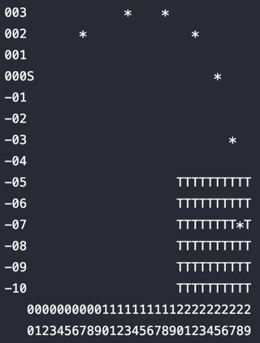

# Advent of Code 2021

| Machine (1)                     | Machine (2)          |
|---------------------------------|----------------------|
| Python 3.8                      | Python 3.11          |
| Macbook Pro                     | Macbook Pro          |
| 3.1 GHz Dual-Core Intel Core i7 | Apple M1 Max         |
| 16 GB 1867 MHz DDR3             | Memory 32GB          |
|                                 | MacOS Ventura 13.4.1 |

| Problem | Time (1)   | Time (2)             |
|---------|------------|----------------------|
| day_01  | 1.7 ms     | 0.6 ms               |
| day_02  | 1.5 ms     | 0.5 ms               |
| day_03  | 3.2 ms     | 1.2 ms               |
| day_04  | 40.1 ms    | 18.8 ms              |
| day_05  | 248.9 ms   | 61.8 ms              |
| day_06  | 1.6 ms     | 0.6 ms               |
| day_07  | 944.4 ms   | 233.1 ms             |
| day_08  | 8.2 ms     | 2.4 ms               |
| day_09  | 44.1 ms    | 11.9 ms              |
| day_10  | 2.7 ms     | 0.8 ms               |
| day_11  | 98.3 ms    | 12.7 ms              |
| day_12  | 4958.8 ms  | 1067.1 ms            |
| day_13  | 424.9 ms   | 89.2 ms              |
| day_14  | 10.7 ms    | 2.0 ms               |
| day_15  | 3298.5 ms  | 1046.4 ms            |
| day_16  | 4.4 ms     | 0.7 ms               |
| day_17  | 1211.4 ms  | 109.7 ms             |
| day_18  | 14345.1 ms | 3092.6 ms            |
| day_19  | 9844.8 ms  | <Broken ?>           |
| day_20  | 7519.5 ms  | 1450.6 ms            |
| day_21  |            | 0.1 ms (PART 1 only) |
| day_22  |            |                      |
| day_23  |            | 32288.9 ms           |
| day_24  |            | 6872.2 ms            |
| day_25  | 4470.3 ms  | 620.4 ms             |

Visuals
- Day 05

- Day 15

- Day 17 (demonstrates a nice curve for the volley, but does not depict the solution.)

- Day 23

