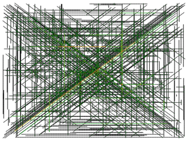

# Advent of Code 2021

Python 3.11

Macbook Pro M1 Max / 32GB of Ram (macOS Monterey)

- [day_01.run]: Completed in 0.6 ms
- [day_02.run]: Completed in 0.5 ms
- [day_03.run]: Completed in 1.2 ms
- [day_04.run]: Completed in 18.8 ms
- [day_05.run]: Completed in 61.8 ms
- [day_06.run]: Completed in 0.6 ms
- [day_07.run]: Completed in 233.1 ms
- [day_08.run]: Completed in 2.4 ms
- [day_09.run]: Completed in 11.9 ms
- [day_10.run]: Completed in 0.8 ms
- [day_11.run]: Completed in 12.7 ms
- [day_12.run]: Completed in 1067.1 ms
- [day_13.run]: Completed in 89.2 ms
- [day_14.run]: Completed in 2.0 ms
- [day_15.run]: Completed in 1046.4 ms
- [day_16.run]: Completed in 0.7 ms
- [day_17.run]: Completed in 109.7 ms
- [day_18.run]: Completed in 3092.6 ms
- [day_19.run]: <broken> ?
- [day_20.run]: Completed in 1450.6 ms
- [day_21.run]: Completed in 0.1 ms (PART 1 ONLY)
- [day_23.run]: Completed in 11288.9 ms (PART 1 ONLY)
- [day_25.run]: Completed in 620.4 ms

MacBook Pro 3.1Ghz Dual-Core i7 / 16GB (macOS Monterey)

Python 3.8

- [day_01.run]: Completed in 1.7 ms
- [day_02.run]: Completed in 1.5 ms
- [day_03.run]: Completed in 3.2 ms
- [day_04.run]: Completed in 40.1 ms
- [day_05.run]: Completed in 248.9 ms
- [day_06.run]: Completed in 1.6 ms
- [day_07.run]: Completed in 944.4 ms
- [day_08.run]: Completed in 8.2 ms
- [day_09.run]: Completed in 44.1 ms
- [day_10.run]: Completed in 2.7 ms
- [day_11.run]: Completed in 98.3 ms
- [day_12.run]: Completed in 4958.8 ms
- [day_13.run]: Completed in 424.9 ms
- [day_14.run]: Completed in 10.7 ms
- [day_15.run]: Completed in 3298.5 ms
- [day_16.run]: Completed in 4.4 ms
- [day_17.run]: Completed in 1211.4 ms
- [day_18.run]: Completed in 14345.1 ms
- [day_19.run]: Completed in 9844.8 ms
- [day_20.run]: Completed in 7519.5 ms
- [day_25.run]: Completed in 4470.3 ms

Visuals
- Day 05

- Day 15

- Day 17 (demonstrates a nice curve for the volley, but does not depict the solution.)

